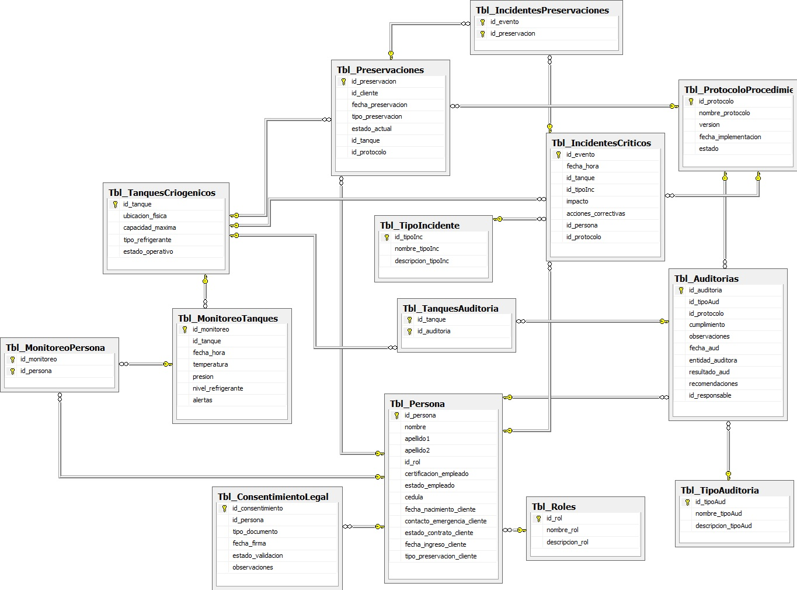
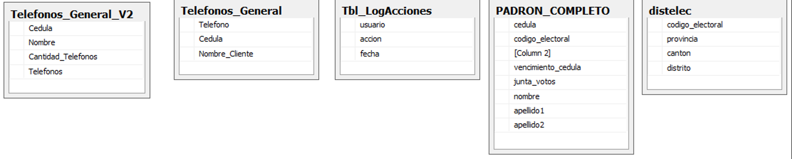
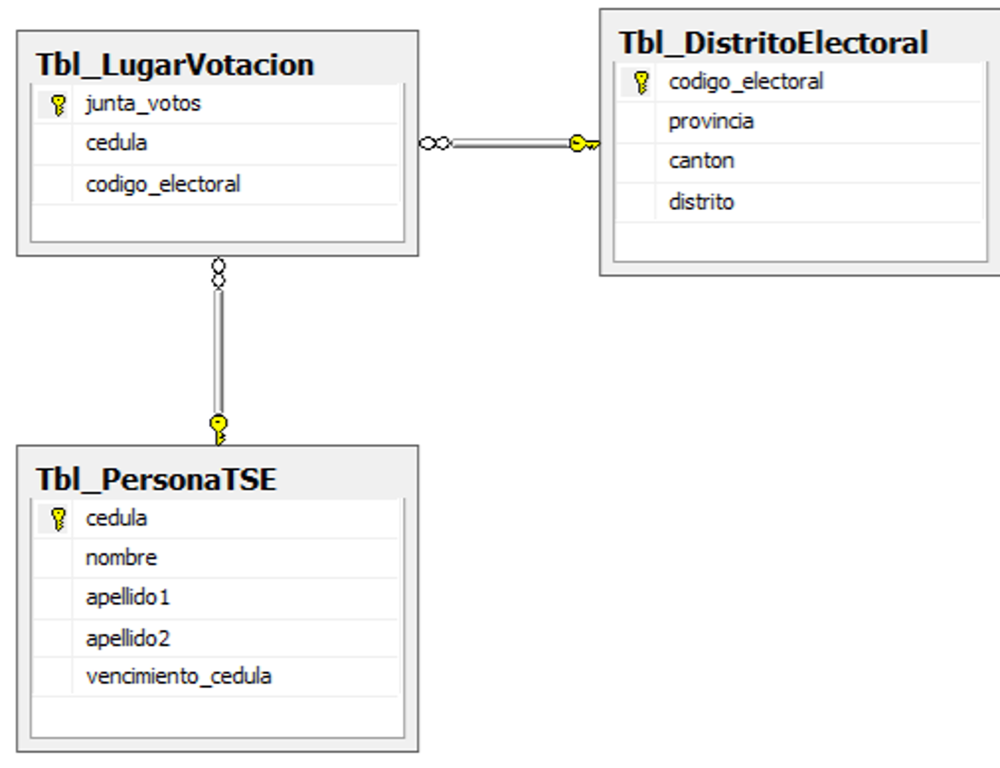

# Cryogenic Preservation Database

SQL Server relational database design for managing cryogenic preservation operations, monitoring, auditing, and incident management.

## Overview

This project models the operational processes involved in cryogenic preservation. The database supports:

- personnel and role management
- legal consent records
- cryogenic tank management
- monitoring of tanks and refrigerant levels
- operational protocols
- internal and external audits
- critical incident tracking
- preservation records
- supporting external reference data

The repository is organized to make the project easy to understand and easy to execute.

## Technologies

- SQL Server
- T-SQL
- Relational database design
- Views
- Triggers
- Foreign keys and referential integrity

## Repository Structure

- `sql/` → executable SQL scripts
- `docs/` → project documentation
- `diagrams/` → ER diagrams and supporting schema images
- `data/` → reduced sample CSV files for testing and demonstration

## Quick Start

To create the full database with sample data:

1. Open `sql/full_database_setup.sql`
2. Run the script in SQL Server

You can also execute the files in this order:

1. `sql/01_external_data_tables.sql`
2. `sql/02_database_schema.sql`
3. `sql/03_sample_data.sql`
4. `sql/04_views.sql`
5. `sql/05_triggers.sql`

## Notes

External reference data for the normalized TSE-related tables was originally based on publicly available Costa Rican electoral registry sources. This public repository includes only the database structure and sample records for demonstration purposes.

## Dataset Notice

To run the complete database workflow, the following files must be downloaded manually:

- The **complete electoral registry dataset** from the official TSE website
- The **telephone datasets** used for data integration

The files included in this repository are **reduced samples intended only to demonstrate the functionality of the SQL scripts and database design**.

If the full datasets are not loaded into the database before running the SQL scripts, some procedures and queries may not function as expected.

## Documentation

Additional project documentation is available in the `docs/` folder:

- `docs/setup-guide.md`
- `docs/data-dictionary.md`

## Database Architecture

### Final ER Diagram

### Auxiliary Tables

### TSE Normalized Schema

### Cryogenics System Schema

## Features

- normalized relational database design
- stored procedures for table creation and data loading
- triggers for validation and audit logging
- views for filtered querying
- integration with external public data sources
- documentation for setup and schema understanding

## Disclaimer

This repository is intended for academic and portfolio purposes. Public source data referenced in this project belongs to its respective official providers. Reduced sample files are included only to demonstrate database structure and script execution.
